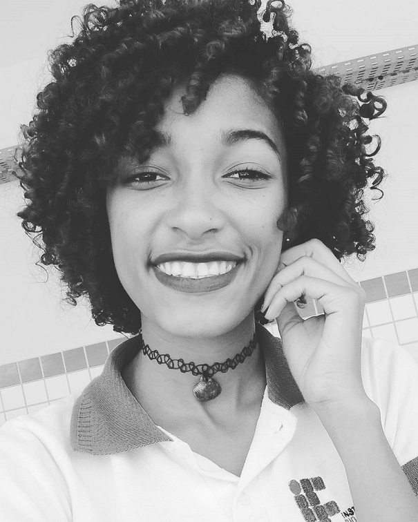
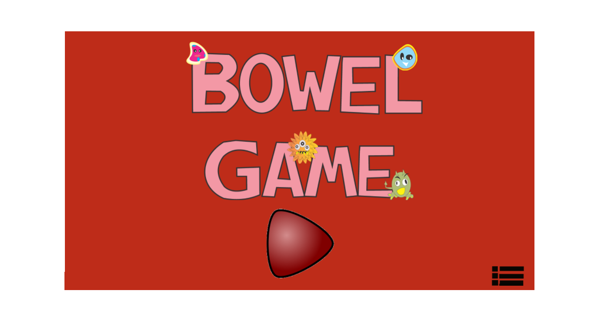
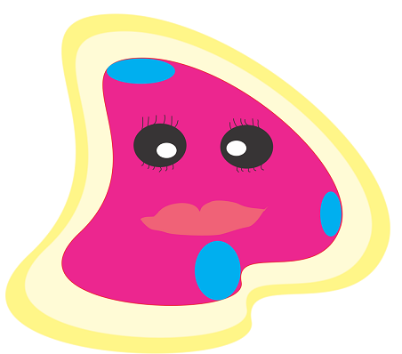
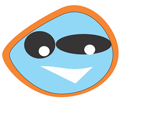
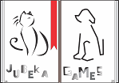
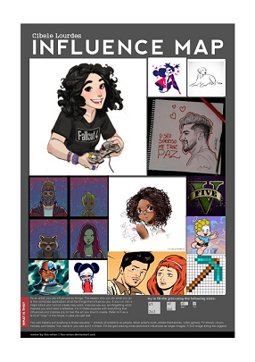
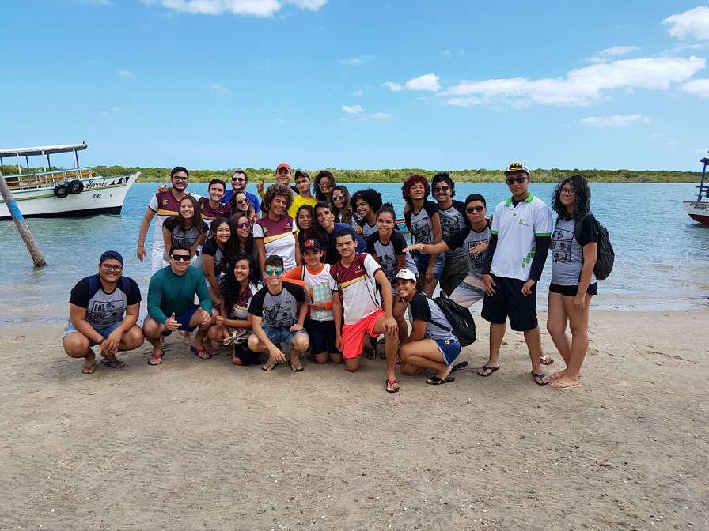
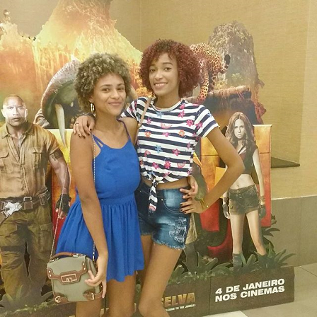
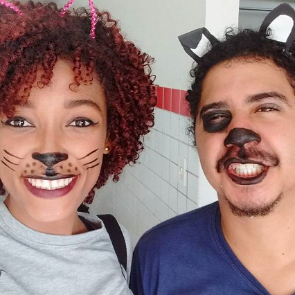

# Quem sou eu? 
  

* Cibele Lourdes
* Aluna de Programação de Jogos Digitais, IFRN Campus Ceará-Mirim.  
* 18 years  
* Luanete   

# Games  

* Criações em conjunto.  

* El Cuerpo  
   
* Labyrinth Food Chain  
  
* Bower Game  
  
  

## Artes

* Bactérias  
          

## Empresas Fictícias  
           

# Projetos  
* Mystery Adventure  
  

* #PraVCComunidade 
* A Visibilidade do Invisivel  

# Influence Map  
  
## Pessoais  
* Aula de campo em Macau/RN, da disciplina de Biologia.   
  
* Aquele cineminha.    
  
* Festa da melhor com os melhores.
  
* Canaval IFRN.  
  

# Contatos  

* Email (cibelelourdes@gmail.com)  

* Segue lá  

***

** negrito  
_ itálico  
~~ riscado  
3* linha horizontal (barra)  
#s uma ou mais hashtags criam capitulos ou sub  
*s asteriscos criam lista não cordenada  
1s númesros criam lista ordenada  

* * *
