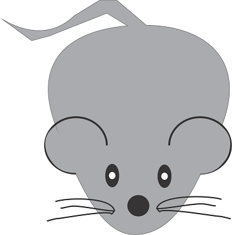
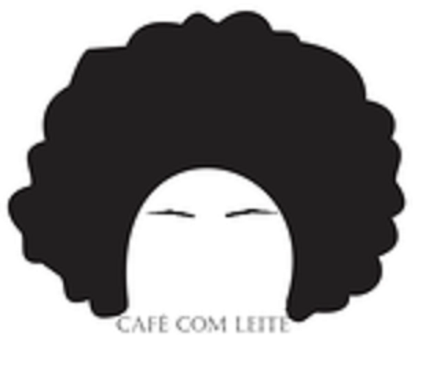
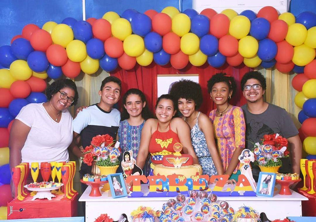

# Quem sou eu? 
  

* Cibele Lourdes
* Aluna de Programação de Jogos Digitais, IFRN Campus Ceará-Mirim.  
* 18 years  
* Gosto de música e de dançar.  
* Empoderada  
* Luanete  

# "Ser feliz sem motivo é a mais autêntica forma de felicidade."   

# Games  

* Criações em conjunto.  

* El Cuerpo  
   
* Labyrinth Food Chain  
  
* Bowel Game  
  
* Mystery Adventure  
  

## Artes

* Bactérias  
       
* Outros  
          

## Empresas Fictícias  
                 

# Projetos  
* #PraVCComunidade 
* A Visibilidade do Invisivel  

# Influence Map  
  
## Pessoais  
* Aula de campo em Macau/RN, da disciplina de Biologia.   
  
* Aquele cineminha.    
  
* Festa da melhor com os melhores.
  
* Carnaval IFRN.  
  

* Mais informações, contatos abaixo:
# Contatos  

* Email (cibelelourdes@gmail.com)  

* Segue lá  

***  
* * *
