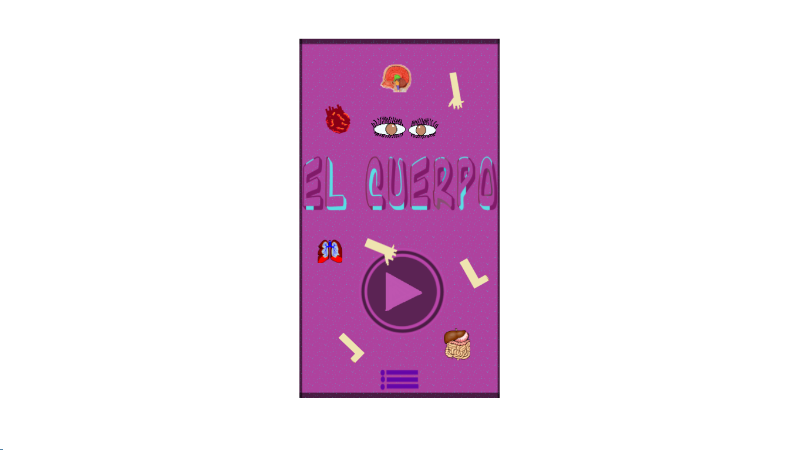

# Quem sou eu? 
  

* Cibele Lourdes
* Aluna de Programação de Jogos Digitais, IFRN Campus Ceará-Mirim.  
* 18 years  
* Luanete   

# Games  

* Criações em conjunto.  

* El Cuerpo  
   
* Labyrinth Food Chain  
  
* Mystery Adventure  
  

## Artes

* Bacteria 
  

## Projetos  

# Contatos  

* Email (cibelelourdes@gmail.com)  

***

** negrito  
_ itálico  
~~ riscado  
3* linha horizontal (barra)  
#s uma ou mais hashtags criam capitulos ou sub  
*s asteriscos criam lista não cordenada  
1s númesros criam lista ordenada  

* * *
